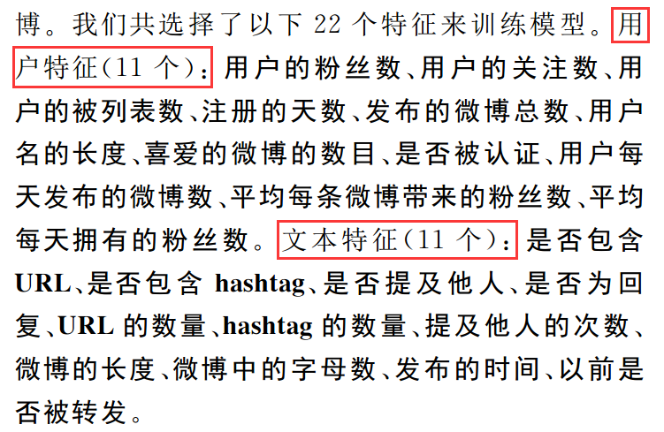
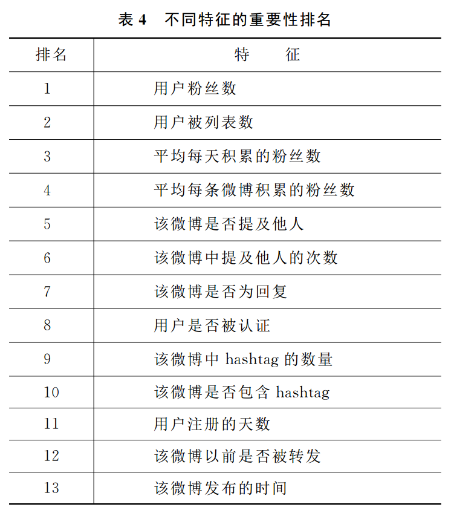
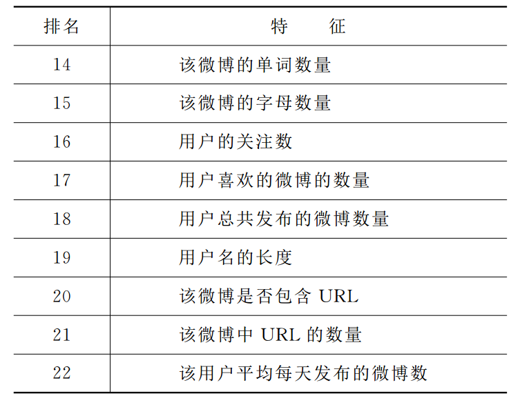

# 国内最早研究转发预测，也是目前引用最多的论文

- [《微博客中转发行为的预测研究》](http://www.cnki.net/KCMS/detail/detail.aspx?QueryID=12&CurRec=2&filename=MESS201204014&dbname=CJFD2012&dbcode=CJFQ&pr=&urlid=&yx=&uid=WEEvREcwSlJHSldRa1FhdkJkdjAzYm00QWlnODQyTTM3N09hSG53b2Fhbz0=$9A4hF_YAuvQ5obgVAqNKPCYcEjKensW4ggI8Fm4gTkoUKaID8j8gFw!!&v=MTU2OTdXTTFGckNVUkx5ZVplUm5GeTNoVkxySUtDallmYkc0SDlQTXE0OUVZSVI4ZVgxTHV4WVM3RGgxVDNxVHI=)

## 阅读笔记

- 中科院 自动化研究所 模式识别实验室
- 中国信息学报
- **基于特征加权的预测模型，86%的准确率**
	- 用户特征
	- 文本特征
- 通过分类实现预测，每条微博通过一组数值来表示，其中每个数值对应一个特征
- 支持向量机（SVM）训练无加权模型
- 基于径向基核函数的SVM模型，借助开源工具`LibSVM`，训练得到基本的预测模型
- 特征选择算法，信息增益算法（IG）
- 用户特征和文本特征几乎同等重要
- 需要改进的地方
    + 忽略了特征之间的联系
    + 关于特征权重的选取，这里只使用了根据信息增益的相对关系的方法

## 要点截图

