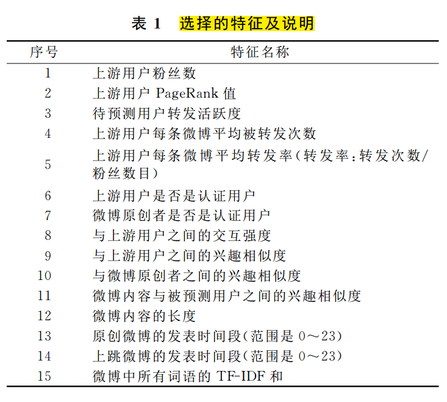

# 新浪微博网信息传播分析与预测

[新浪微博网信息传播分析与预测](http://search.cnki.net/KCMS/detail/detail.aspx?dbcode=CJFQ&dbname=CJFD2014&filename=JSJX201404005&uid=WEEvREcwSlJHSldRa1FhdkJkdjAzYm00QWlydGJPN3hlTkdWYkRZcC81az0=$9A4hF_YAuvQ5obgVAqNKPCYcEjKensW4ggI8Fm4gTkoUKaID8j8gFw!!&v=MDAwNDFyQ1VSTHllWmVSbkZ5L2xXcjNNTHo3QmRyRzRIOVhNcTQ5RllZUjhlWDFMdXhZUzdEaDFUM3FUcldNMUY=)

## 阅读笔记

- 东南大学计院和安徽工业大学计院
- 计算机学报
- 可能影响用户转发行为的因素：提出基于用户属性、社交关系和微博内容三类综合特征
- 基于微博关注关系拓扑，利用信息传播路径级联概率模型对给定微博的转发路径进行预测，为预测微博的影响范围提供依据
- 微博关注网络具有较高的聚类系数和较小的平均距离，符合小世界特征，但节点之间的平均距离更小。说明微博上人与人之间的联系更加紧密，消息往往只需经过很小的跳数就可以传播到网络上的其他人
- 推动微博在网络上扩散的原因不仅仅在于微博内容，更在于是否有高入度的节点参与转发
- **过滤掉活跃度过低的用户**
- 转发样本的识别：api字段
- **忽略样本的识别**
- 累计概率分布函数：描述一个特征对于用户不同行为的区分度
- **用户的PageRank值**：使用Graphchi包计算
- 用户转发活跃度
- **与上游用户的交互强度**
- 微博内容与用户历史兴趣相似度
- 与转发路径上游用户间的兴趣相似度
- 76.2%的微博能够被正确预测，对于较短的转发路径预测精度能达到40%左右
- 需要改进的地方
    + 考虑的特征不够全面
    + 僵尸粉、水军，没有剔除

## 要点截图

