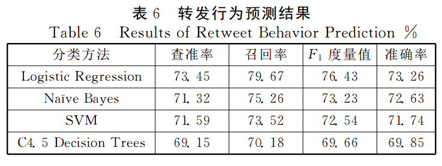

# 社交网络中微博用户行为的分析与预测

[下载地址](http://www.cnki.net/KCMS/detail/detail.aspx?QueryID=13&CurRec=4&filename=TYGY201606020&dbname=CJFDTEMP&dbcode=CJFQ&pr=&urlid=&yx=&uid=WEEvREcwSlJHSldRa1FhcEE0L01SR3lTbTRHSTNQNzF0R085VHA2OUlhbz0=$9A4hF_YAuvQ5obgVAqNKPCYcEjKensW4IQMovwHtwkF4VYPoHbKxJw!!&v=MTg0ODk5Zk1xWTlIWklSOGVYMUx1eFlTN0RoMVQzcVRyV00xRnJDVVJMeWVaZVJtRnkzblVyN0lNVFRNZDdHNEg=)

## 阅读笔记
- 清华大学唐杰副教授团队公布的微博数据
- 识别不转发行为
- 影响因素分析
    + 用户特征
        * 发布用户的影响力
        * 用户的转发活跃度
    + 微博特征
    + 交互特征
        * 接收用户与上层用户的交互程度
        * 微博内容与接收用户兴趣相似度
    + 结构特征
        * 朋友节点的影响
        * 结构的多样性
- 使用逻辑回归的预测效果最高，准确性达到76.43%
- 共使用了4种方法
    + Logistic Regression 逻辑回归
    + Naive Bayes 朴素贝叶斯
    + Support Vector Machine (SVM) 支持向量机
    + C4.5 Decision Trees 决策树

## 要点截图

